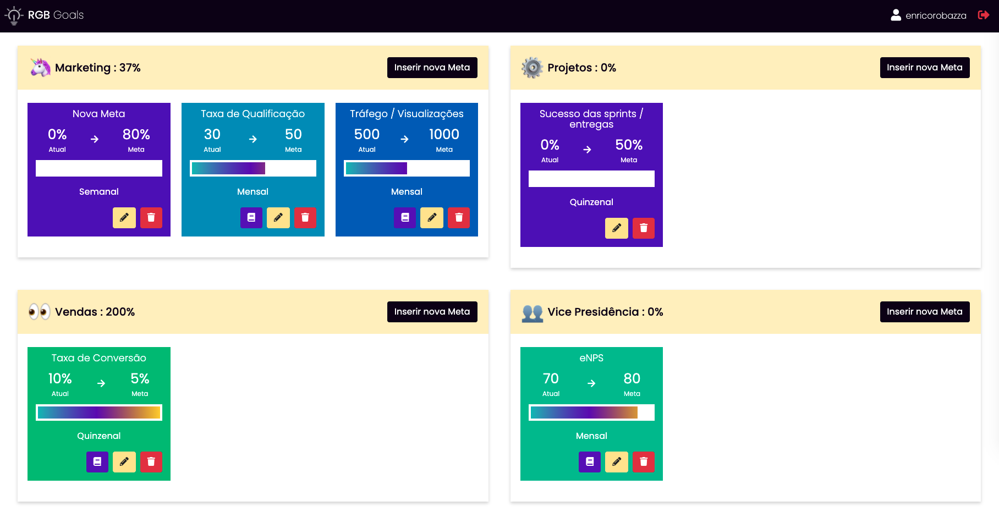
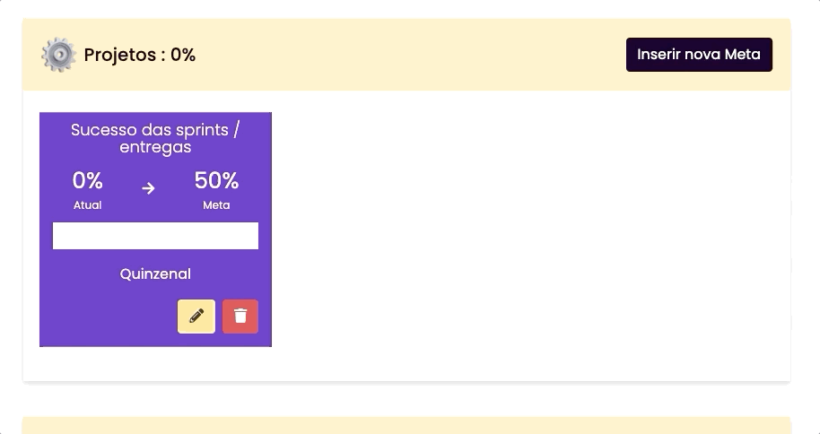

# RGB Goals

This is an Example project to test Django and React integration with component as a page.

This project utilizes Webpack to bundle React components and insert the bundles inside Django Templates. 

## Benefits:
- This way we are able to render a basic page with Django (SSR) and after that we can render the React App (CSR).
- We can choose wheter we want to render a page in Django or in React.
- We can populate data as default props to React components without having to load via ajax.
- We can still utilize Django features for rendering front-end, managing routes, managing authentication...
- We can even get a form rendered via Django Templates and pass it as a html string to be rendered inside a React Component.

## Preview:


### Gifs:
 

## Live:
[https://rgbgoals.herokuapp.com/](https://rgbgoals.herokuapp.com/)


```
Login: example
Password: MyPassword123!
```
